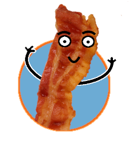

# Liquid Argon Reconstruction Done in PythON

## Librairies needed to run lardon
You need miniconda installed :

https://docs.conda.io/en/latest/miniconda.html#linux-installers

and then get the librairies as stated in **lardenv.yml** :

`conda env create -f lardenv.yml`

 :warning: It'll take about 2-3 GB of space!

then : `conda activate lardenv`

## Before running lardon
Check and modify **config.py** :
* *store_path* : your directory where the output file will be stored
* *plot_path*  : your directory where control plots will be stored
* Comment/uncomment run specific parameters (Nb of CRP used in the reconstruction, broken channels, drift field, ...)
(:information_source: This should be automatized soon-ish))

## To run lardon on data
`python reader.py -run <run nb> -sub <subfile name> -n <nb of events (optional)> -out <output file option>`

*e.g.* : `python reader.py -run 1415 -sub 1_a -n 10 -out example`

## To run lardon on MC : 
add `-mc the_mc_root_file.root`

the simulation will be added to a run of data (preferably a noise only run!)

:warning: Note that the MC file should be in a specific format - This part is still under development

## lardon CRP/VIEW Convention

* electrons drift along z axis - the cathode is at z=-300cm
* all distance are in cm

## Reconstruction Parameters
The file **default_reco.yaml** contains all parameters needed for the reconstruction. If you want to change/add parameters, you can create your own **.yaml** file, following the `name: value` format. You don't have to copy all variables, the default one will be taken. 

## Control Plots
By default, no control plots are produced, but you can call the plotting functions in **reader.py** anywhere in the reconstruction loop.

All plot functions have the two options :
* option="extra_output_name_if_you_want" [default is none] 
* to_be_shown=True/False if you want to see the plot live [default is False]

### To plot the current event display:
`plot.plot_ed_data()`

take a look at **plotting/event_display.py** to see all possible plots (just one crp/one view, zoom, ...)

### To plot the current waveform(s):
`plot.plot_wvf_single_current([(crp,view,ch),(crp,view,ch),..])` [one wvf/plot]

`plot.plot_wvf_multi_current([(crp,view,ch),(crp,view,ch),..])` [all wvf superimposed]

### To plot a waveform evolution: 
`plot.plot_wvf_evo([wvf1, wvf2,...], title="your plot title", legends=['leg1', 'leg2',...])`

where wvf1 would be a copy of the waveform at some point in the reconstruction with :

`wvf1 = dc.data(crp, view, ch, :].copy()`

### To plot hits found / clusters found:
`plot.plot_2dcrp_clusters()` <- shown in CRP/View format

`plot.plot_2dview_clusters()` <- shown in x/y format

[same for plot_2dxxx_hits()]

### To plot 2D tracks (and hits):
`plot.plot_2dview_2dtracks()` 

### To plot 3D tracks:
`plot.plot_2dview_hits_and_3dtracks()` <- two views separated (all hits and 2d tracks also shown)

`plot.plot_3d()` <- in 3d 

