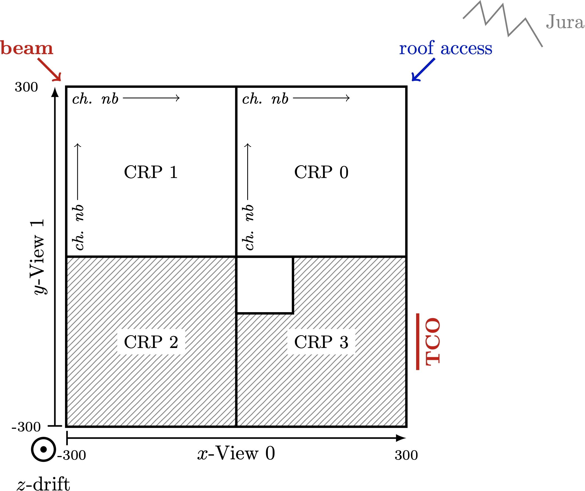

# Liquid Argon Reconstruction Done in PythON

## Librairies needed to run lardon
You need miniconda installed :

https://docs.conda.io/en/latest/miniconda.html#linux-installers

and then get the librairies as stated in **lardenv.yml** :

`conda env create -f lardenv.yml`

 :warning: It'll take about 2-3 GB of space!

then : `conda activate lardenv`

The `rtree` library is now also needed, but cannot be downloaded from conda. 
Instructions to get it within `lardenv`:
* all above steps
* `cd /your_miniconda_repository/envs/lardenv/bin`
* `pip install rtree`
 
## Before running lardon
Check and modify **config.py** :
* *store_path* : your directory where the output file will be stored
* *plot_path*  : your directory where control plots will be stored
* Update `np02/runs.yaml` if needed

## To run lardon on data
To launch lardon, type `python reader.py` with the following options:
* `-run <run nb>` which run number
* `-sub <subfile name>` which subfile (*e.g.* 1_a)
* `-n <nb of events>` how many events to process, default is -1=all file
* `-out <output file option>` optional extra name for the output
* `-type <type of data>` for the special runs, default is cosmic
* `-reco <your_reco_parameters.yaml>` if you want to change some reconstruction parameters, default uses **default_reco.yaml**

*e.g.* : To run the first 10 events of run 1415, subfile 5_b, type :

`python reader.py -run 1415 -sub 5_b -n 10 -out example`

the output h5file will be **store_path/1415_5_b_example.h5**

## To run lardon on MC : 
add `-mc the_mc_root_file.root`

the simulation will be added to a run of data (preferably a noise only run!)

:warning: Note that the MC file should be in a specific format - only from Qscan at the moment

## lardon CRP/VIEW Convention

* electrons drift along z axis - the cathode is at z=-300cm
* all distance are in cm

## Reconstruction Parameters
The file **default_reco.yaml** contains all parameters needed for the reconstruction. If you want to change/add parameters, you can create your own **.yaml** file, following the `name: value` format. You don't have to copy all variables, the default one will be taken. 

## Control Plots
By default, no control plots are produced, but you can call the plotting functions in **reader.py** anywhere in the reconstruction loop.

All plot functions have the two options :
* option="extra_output_name_if_you_want" [default is none] 
* to_be_shown=True/False if you want to see the plot live [default is False]

### To plot the current event display:
`plot.plot_ed_data()`

take a look at **plotting/event_display.py** to see all possible plots (just one crp/one view, zoom, ...)

### To plot the current waveform(s):
`plot.plot_wvf_single_current([(crp,view,ch),(crp,view,ch),..])` [one wvf/plot]

`plot.plot_wvf_multi_current([(crp,view,ch),(crp,view,ch),..])` [all wvf superimposed]

### To plot a waveform evolution: 
`plot.plot_wvf_evo([wvf1, wvf2,...], title="your plot title", legends=['leg1', 'leg2',...])`

where wvf1 would be a copy of the waveform at some point in the reconstruction with :

`wvf1 = dc.data(crp, view, ch, :].copy()`

### To plot hits found / clusters found:
`plot.plot_2dcrp_clusters()` <- shown in CRP/View format

`plot.plot_2dview_clusters()` <- shown in x/y format

[same for plot_2dxxx_hits()]

### To plot 2D tracks (and hits):
`plot.plot_2dview_2dtracks()` 

### To plot 3D tracks:
`plot.plot_2dview_hits_and_3dtracks()` <- two views separated (all hits and 2d tracks also shown)

`plot.plot_3d()` <- in 3d 

